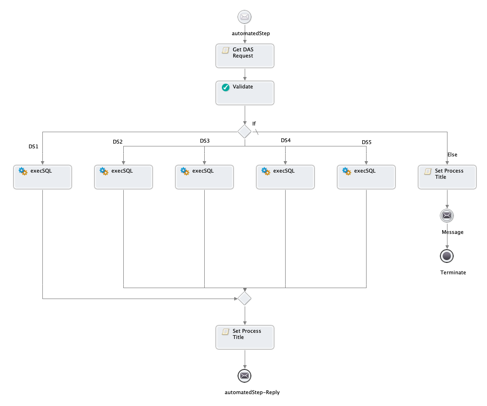
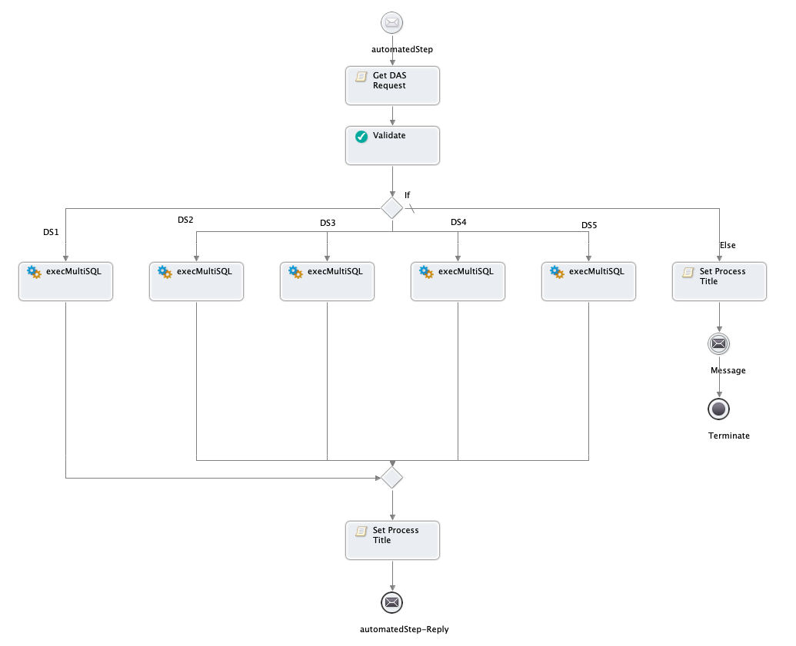

# Data Access Service Support for Informatica Cloud Application Integration

<!-- MarkdownTOC -->

- [Data Access Service Support for Informatica Cloud Application Integration](#data-access-service-support-for-informatica-cloud-application-integration)
  - [Introduction](#introduction)
  - [Features](#features)
  - [Installation](#installation)
  - [Install this package on ICS/ICAI](#install-this-package-on-icsicai)
  - [Package Contents](#package-contents)
  - [DAS Wrapper Components](#das-wrapper-components)
    - [BPEL Processes (Automated Steps)](#bpel-processes-automated-steps)
      - [execSQL.bpel](#execsqlbpel)
        - [tDataAccessRequest Object](#tdataaccessrequest-object)
  - [DAS Service Request Examples](#das-service-request-examples)
    - [Complete tDataAccessRequest Structure example](#complete-tdataaccessrequest-structure-example)
    - [Invoke DDL STatement](#invoke-ddl-statement)
    - [Prepared Statement (Insert)](#prepared-statement-insert)
    - [Parameter Batch Insert](#parameter-batch-insert)
    - [Select Request](#select-request)
    - [Invoke Stored Procedure or function](#invoke-stored-procedure-or-function)
      - [execMultiSQl.bpel](#execmultisqlbpel)
  - [Example Multi Data Access Request](#example-multi-data-access-request)
    - [PDDs](#pdds)
    - [XQuery Library Modules](#xquery-library-modules)
    - [Automated Step Service Metadata](#automated-step-service-metadata)
  - [Possible Adjustments](#possible-adjustments)
    - [Add Support for Additional Data Sources](#add-support-for-additional-data-sources)

<!-- /MarkdownTOC -->

## Introduction

Informatica Cloud Application Integration Platform (ICAI) provides many built in connectors including JDBC Connector.

Although JDBC Connector provide simple metadata-driven access to read and write database records, you may need some more advanced access that is not supported by this connector such as

- Bulk inserts, updates
- Invoke Arbitrary SQL including DDL statements
- Invoke Stored Procedures
- Access Database Specific features such as Invoking Oracle Pipelined and Parallel Table Functions
- Performance Optimized Queries

Informatica Process Engine provides built-in JDBC Connectivity which can be leveraged in such cases, but requires ad-hoc use of Data Access Service (DAS).

Data Access Service provides implementers with the ability to interact with a database to manipulate its structure and content, and execute SQL Statements and stored procedures.

This package contains a Generic Wrapper for this Service which allows consumption of this System Service directly from IPD processes
[See the documentation for DAS](https://network.informatica.com/onlinehelp/activevos/current/index.htm#page/bb-av-designer/Data_Access_Service.html)

## Features

- Support for execSQL and execMultiSql operations
- Supports all parameters and data types supported by the DAS (except binary blobs and attachments)
- Support for stored procedures calls and batched updates
- Exposed as Automated Step (Seamless integration with IPD)
- Support up to 5 Data sources (possible to extend)

## Installation

You will need an Informatica Process Developer to build and install this package

## Install this package on ICS/ICAI

1. Install and Configure Informatica Process Developer ([Open Installation guide](https://github.com/jbrazda/Informatica/blob/master/Guides/InformaticaCloud/install_process_developer.md))
2. Import this project zip into an eclipse workspace using Eclipse menu `File > Import > Existing Projects into Workspace` select the Archive Option
3. Validate the project and check for errors
4. Create `target/bpr` directory in the project toot
5. Run `File > Export > Orchestration > Contribution - Business Process Archive` project export wizard
6. Make sure that you  set following export parameter as follows
7. Bpr File: `/com.informatica.cloud.das/target/bpr/com.informatica.cloud.das.bpr`
8. Check the `Save the contribution specification as Ant script ...` option, it is useful for subsequent builds
9. Set the Target bprd file name to `/com.informatica.cloud.das/deploy/com.informatica.cloud.das.bprd`'
10. Optionally you can set the deployment option to deeply directly to your cloud org, this saves one step in the deployment as you have to deploy manually only to agents
11. Deployment Url should be following `https://[Your_POD_Hostname]/active-bpel/services/[YOURORGID]/ActiveBpelDeployBPR` i.e. `https://na1.ai.dm-us.informaticacloud.com/active-bpel/services/d8UL5i5Pm4KddufpfKuiaN/ActiveBpelDeployBPR`
12. Deploy the produced bpr from `/com.informatica.cloud.das/target/bpr/com.informatica.cloud.das.bpr` bot to your cloud org and all agents where you want to use this DAS service (alternatively pre-built latest bpr is available on release page [com.informatica.cloud.das.bpr](https://github.com/jbrazda/com.informatica.cloud.das/releases/latest/download/com.informatica.cloud.das.bpr))
13. Import attached [IPD_SOURCE_DAS-IICS.zip](https://github.com/jbrazda/com.informatica.cloud.das/releases/latest/download/IPD_SOURCE_DAS-IICS.zip) to your IPD
14. Adjust target Agent name in the imported Proxy processes `execSQLProxy` and `execMultiSQLProxy`
15. Setup and Configure DS1 to DS{n} in the `Process Console > Admin >  Datasource Service` section
16. Publish all provided resources imported in the step 15
17. You can use provided test case to verify functionality (test need write and create table, drop table permissions as it creates/drops test table)
18. Use the provided `TEST DAS` process as reference and example of use to build your own processes

> Note: step 12 in the installation can be also performed via web service when you have access toi Secure Agent the URL would be `http://hostname:7080/process-engine/services/ActiveBpelDeployBPR`

## Package Contents

- Automated Steps Processes supporting `execSQL` and `execMultiSql` operations of the DAS
- Metadata to describe Automated step to IPD
- Components to Support IPD Processes
    - Service Connector and Connection - provides metadata about the Automated Step Input/Output Parameters
    - Example Proxy Services (Provide access to Automated Steps from The Cloud Process or Guides)
    - Test Cases and sample code
    - Sample Data
    - Documentation

## DAS Wrapper Components

### BPEL Processes (Automated Steps)

#### execSQL.bpel

Process Implements Automated Step Service  available in the IPD under
`Services > Data Access Services > execSQL`



__Input Fields:__

|        Name       |                  Type                  |        Description         |
|-------------------|----------------------------------------|----------------------------|
| dataAccessRequest | `DataAccessService:tDataAccessRequest` | tDataAccessRequest  Object |

__Output Fields:__

|        Name        |              Type             |   Description    |
|--------------------|-------------------------------|------------------|
| dataAccessResponse | `DataAccessService:tResponse` | tResponse Object |

##### tDataAccessRequest Object

execSQL Parameters

|    Parameter    |                                                                                                                        Description                                                                                                                        |
|-----------------|-----------------------------------------------------------------------------------------------------------------------------------------------------------------------------------------------------------------------------------------------------------|
| sqlStatement    | Element containing the required `<statement>` and optional parameters                                                                                                                                                                                       |
| includeMetadata | Returns a row of metadata about the query columns prior to the actual return data (default = false). Meta data includes data type and display size.                                                                                                       |
| maxRows         | Maximum number of result rows to be returned. (default = 0 or unlimited)                                                                                                                                                                                  |
| maxWaitSeconds  | Maximum time to wait for results. (default = 0 or unlimited)                                                                                                                                                                                              |
| columnCase      | Specifies the case formatting of the columns in the result set (default is unchanged from server). Schema enumerations defined for this element include lowercase, uppercase, and unchanged                                                               |
| statementId     | Specified as part of request to help identify results (default is to auto generate an Id that results in an Id such as statement-1, statement-2)                                                                                                          |
| statement       | (Required.) SQL statement to execute                                                                                                                                                                                                                      |
| parameter       | Identifies the data to be inserted, updated or deleted from the data source. Parameter values are listed in order within a `<parameterBatch>` element associated with a statement. See Parameter-Based Request for Insert, Update, Delete Statements below. |
| sqlType         | Parameter attribute. Types include string (default), byte, short, int, long, float, double, date, binary, or clob                                                                                                                                   |
| attachmentId    | Parameter attribute. Specified as part of request to help identify results attachments, if any. See Handling Binary Data below.                                                                                                                           |
| hasResultSet    | Indicates that a stored procedures returns data. Only use this parameter if this is true.                                                                                                                                                                 |

Note that the `<parameter>`, `<parameterBatch>` and `<procedure>` elements of the tDataAccessRequest are optional and mutually exclusive. You will use list of parameters only when the `<statement></statement>` field (element) contain SQL statement formulated as prepared statements such as

```sql
INSERT INTO test_table
    (col_varchar,
    col_int,
    col_datetime,
    col_bigint)
values
    (?,?,?,?)
```

## DAS Service Request Examples

### Complete tDataAccessRequest Structure example

```xml
<tDataAccessRequest>
   <sqlStatement>
      <maxRows></maxRows>
      <maxWaitSeconds></maxWaitSeconds>
      <statementId></statementId>
      <columnCase></columnCase>
      <includeMetadata></includeMetadata>
      <hasResultSet></hasResultSet>
      <statement></statement>
      <parameter>
         <sqlType></sqlType>
         <attachmentId></attachmentId>
         <data></data>
         <attachment></attachment>
      </parameter>
      <parameterBatch>
         <parameter>
            <sqlType></sqlType>
            <attachmentId></attachmentId>
            <data></data>
            <attachment></attachment>
         </parameter>
      </parameterBatch>
      <procedure>
         <procedureParameter>
            <name></name>
            <sqlType></sqlType>
            <mode></mode>
            <data></data>
            <attachment></attachment>
         </procedureParameter>
      </procedure>
   </sqlStatement>
   <dataSource></dataSource>
</tDataAccessRequest>
```

### Invoke DDL STatement

You can use DAS to invoke even DDL statements such as

```xml
 <tDataAccessRequest>
    <dataSource>DS1</dataSource>
    <sqlStatement>
       <statement>CREATE TABLE test_table (
            idtest_table INT NULL AUTO_INCREMENT,
            col_varchar VARCHAR(45) NULL,
            col_int INT NULL,
            col_datetime DATETIME NULL,
            col_bigint BIGINT NULL,
            PRIMARY KEY (idtest_table),
            UNIQUE INDEX idtest_table_UNIQUE (idtest_table ASC));</statement>
       <includeMetadata>true</includeMetadata>
       <statementId>create_test_table</statementId>
       <hasResultSet>false</hasResultSet>
    </sqlStatement>
 </tDataAccessRequest>
```

### Prepared Statement (Insert)

It is recommended to use parametrized queries unless you invoking some static SQL, Constructing SQL statements by string concatenation is considered unsafe and prone for SQL injection attacks especially when the parameters might be a user input on the web page or request parameter. prefer prepared statement style of invocation whenever possible.

Here is and example of such statements

```xml
<tDataAccessRequest>
   <sqlStatement>
      <statementId>insert_rows</statementId>
      <hasResultSet>false</hasResultSet>
      <statement>INSERT INTO test_table
        (col_varchar,
        col_int,
        col_datetime,
        col_bigint)
        values (?,?,?,?)</statement>
      <parameter>
         <sqlType>string</sqlType>
         <data>test</data>
      </parameter>
      <parameter>
         <sqlType>int</sqlType>
         <data>23</data>
      </parameter>
      <parameter>
         <sqlType>date</sqlType>
         <data>{fn:current-dateTime()}</data>
      </parameter>
      <parameter>
         <sqlType>double</sqlType>
         <data>12345678</data>
      </parameter>
   </sqlStatement>
   <dataSource>DS1</dataSource>
</tDataAccessRequest>

```

Response Example:

```xml
<tResponse>
    <statementId>insert_rows</statementId>
    <row>
       <updatedRows>1</updatedRows>
    </row>
</tResponse>
```

### Parameter Batch Insert

Parameter batch will be used in the case when you want to perform bulk inserts or updates  here is an example of such request

```xml
<tDataAccessRequest>
   <sqlStatement>
      <statementId>test_table_insert_many</statementId>
      <columnCase></columnCase>
      <hasResultSet>false</hasResultSet>
      <statement>INSERT INTO test_table
        (col_varchar,
        col_int,
        col_datetime,
        col_bigint)
        values (?,?,?,?)</statement>

      <parameterBatch>
          <parameter>
           <sqlType>string</sqlType>
           <data>test</data>
          </parameter>
          <parameter>
             <sqlType>int</sqlType>
             <data>2</data>
          </parameter>
          <parameter>
             <sqlType>date</sqlType>
             <data>{fn:current-dateTime()}</data>
          </parameter>
          <parameter>
             <sqlType>double</sqlType>
             <data>444444444</data>
          </parameter>
      </parameterBatch>
      <parameterBatch>
          <parameter>
           <sqlType>string</sqlType>
           <data>3</data>
          </parameter>
          <parameter>
             <sqlType>int</sqlType>
             <data>test</data>
          </parameter>
          <parameter>
             <sqlType>date</sqlType>
             <data>{fn:current-dateTime()}</data>
          </parameter>
          <parameter>
             <sqlType>double</sqlType>
             <data>987654321</data>
          </parameter>
      </parameterBatch>

   </sqlStatement>
   <dataSource>DS1</dataSource>
</tDataAccessRequest>
```

Example Response:

```xml
<tResponse>
    <statementId>test_table_insert_many</statementId>
    <row>
       <updatedRows>1</updatedRows>
    </row>
    <row>
       <updatedRows>1</updatedRows>
    </row>
</tResponse>
```

### Select Request

Select Request Example:

```xml
<tDataAccessRequest>
    <sqlStatement>
       <maxRows>10</maxRows>
       <maxWaitSeconds>5</maxWaitSeconds>
       <statementId>test_table_select_all</statementId>
       <columnCase>unchanged</columnCase>
       <includeMetadata>true</includeMetadata>
       <hasResultSet>false</hasResultSet>
       <statement>SELECT * FROM test_table</statement>
    </sqlStatement>
    <dataSource>DS1</dataSource>
 </tDataAccessRequest>
```

Select Response Example:

```xml
<tResponse>
    <statementId>test_table_select_all</statementId>
    <metadata>
       <idtest_table>
          <dataType>INT</dataType>
          <displaySize>11</displaySize>
       </idtest_table>
       <col_varchar>
          <dataType>VARCHAR</dataType>
          <displaySize>45</displaySize>
       </col_varchar>
       <col_int>
          <dataType>INT</dataType>
          <displaySize>11</displaySize>
       </col_int>
       <col_datetime>
          <dataType>DATETIME</dataType>
          <displaySize>19</displaySize>
       </col_datetime>
       <col_bigint>
          <dataType>BIGINT</dataType>
          <displaySize>20</displaySize>
       </col_bigint>
    </metadata>
    <row>
       <idtest_table>1</idtest_table>
       <col_varchar>test</col_varchar>
       <col_int>23</col_int>
       <col_datetime>2017-03-30T16:52:28Z</col_datetime>
       <col_bigint>12345678</col_bigint>
    </row>
    <row>
       <idtest_table>2</idtest_table>
       <col_varchar>test</col_varchar>
       <col_int>2</col_int>
       <col_datetime>2017-03-30T16:52:29Z</col_datetime>
       <col_bigint>444444444</col_bigint>
    </row>
    <row>
       <idtest_table>3</idtest_table>
       <col_varchar>3</col_varchar>
       <col_int/>
       <col_datetime>2017-03-30T16:52:29Z</col_datetime>
       <col_bigint>987654321</col_bigint>
    </row>
</tResponse>
```

### Invoke Stored Procedure or function

Request:

```xml
<DataAccessRequest>
   <sqlStatement>
      <statementId>SOME_PKG.function</statementId>
      <columnCase>lowercase</columnCase>
      <hasResultSet>false</hasResultSet>
      <statement>CALL SOME_PKG.function(?,?)</statement>
      <procedure>
         <procedureParameter>
            <name>PARAMETER1</name>
            <sqlType>string</sqlType>
            <mode>in</mode>
            <data>{$p1data}</data>
         </procedureParameter>
         <procedureParameter>
            <name>PARAMETER2</name>
            <sqlType>string</sqlType>
            <mode>out</mode>
            <data>{$p1data}</data>
         </procedureParameter>
      </procedure>
   </sqlStatement>  
   <dataSource>DS1</dataSource>
</DataAccessRequest>
```

Important part is to map the parameter types correctly with the respect of the SQL types
DAS does not support Oracle object array types, only following types are supported

Parameter attribute. Types include string (default), byte, short, int, long, float, double, date, binary, or clob
Binary requires special handling to send data as attachment and it is not supported by this DAS wrapper implementation

You should be able to specify both in/out parameters - read more about data access service [here](
https://docs.informatica.com/process-automation/informatica-activevos/current-version/2----designer/building-a-process-with-a-system-service/data-access-service.html)

#### execMultiSQl.bpel

This allows to invoke multiple Database statements in one request, this is very useful when you need to run multiple statements of a different kind. It supports the same set parameters and both static and parametrized queries as well as stored procedures and DDL statement as the execSQL Service. It only adds ability to execute multiple statements at the same time where the DAs service provides individual result set or output for each statement
`execMultiSQL` supports can be used for example to couple two statements together such as inserting a row to the database and finding out the primary key  generated as auto-increment or a sequence by the database which is often Database specific.



## Example Multi Data Access Request

```xml
<tMultiDataAccessRequest>
   <sqlStatement>
      <statementId>insert_rows</statementId>
      <hasResultSet>false</hasResultSet>
      <statement>INSERT INTO test_table
        (col_varchar,
        col_int,
        col_datetime,
        col_bigint)
        values (?,?,?,?)</statement>
      <parameter>
         <sqlType>string</sqlType>
         <data>test</data>
      </parameter>
      <parameter>
         <sqlType>int</sqlType>
         <data>23</data>
      </parameter>
      <parameter>
         <sqlType>date</sqlType>
         <data>{fn:current-dateTime()}</data>
      </parameter>
      <parameter>
         <sqlType>double</sqlType>
         <data>12345678</data>
      </parameter>
   </sqlStatement>
   <sqlStatement>
      <statementId>get_rows_id</statementId>
      <hasResultSet>true</hasResultSet>
      <statement>SELECT LAST_INSERT_ID()</statement> <!-- Get Last inserted ID in MySql-->
      <!-- in SQL Server use SELECT SCOPE_IDENTITY()  -->
   </sqlStatement>
   <dataSource>DS1</dataSource>
</tMultiDataAccessRequest>

```

Response:

```xml
<multiDataAccessResponse>
    <result>
       <statementId>insert_rows</statementId>
       <row>
          <updatedRows>1</updatedRows>
       </row>
    </result>
    <result>
       <statementId>get_rows_id</statementId>
       <row>
          <LAST_INSERT_ID>4</LAST_INSERT_ID>
       </row>
    </result>
</multiDataAccessResponse>
```

### PDDs

Each BPEL process (Service) needs a [Process Deployment Descriptor](http://infocenter.activevos.com/infocenter/ActiveVOS/v92/index.jsp?topic=/com.activee.bpep.doc/html/UG20-5.html) to describe the process to a process engine.
These are located in the deploy directory of this project
Please consult the Documentation for further details on PDDs

### XQuery Library Modules

This package contains two main modules

- `/com.informatica.cloud.das/xquery/infa-das.xq` Module that implements custom function to transform input/output process object to the wire SOAP message format required by the DAS service and transform DAS responses back to simplified XML format of the process object response data
- `com.informatica.cloud.das/test/xquery/infa-das-test.xq` - unit test to validate functionality of the `infa-das.xq` library module
- `com.informatica.cloud.das/test/xquery/infa-das-test.xq` - Library module for unit testing

### Automated Step Service Metadata

IPD needs a metadata to provide access to Services in the Designer, to make the automated step visible we need to provide a service descriptor similar to a metadata used and generated by the IPD designer In this case we have to create such file manually by following the XSD schema provided by the platform. Here is a complete listing of the `config/services.xml` provided with this package.

```xml
<?xml version="1.0" encoding="UTF-8"?>
<screenflowContribution xmlns="http://schemas.active-endpoints.com/appmodules/screenflow/2010/10/avosServiceDiscovery.xsd">
   <service name="execSQL">
      <avosServiceName>execSQL</avosServiceName>
      <displayName>execSQL</displayName>
      <category>Data Access Services</category>
      <description>You can interact directly with a data source within a IPD process by using the Data Access system service.
Using this service, you create an invoke activity that executes one statement on a specified data source and receives a result set as the response.
This service Supports One SQL statement, but multiple batched updates/inserts</description>
      <iconLocation>project:/com.informatica.cloud.das/images/database.png</iconLocation>
      <largeIconLocation>project:/com.informatica.cloud.das/images/database.png</largeIconLocation>
      <input>
         <parameter name="dataAccessRequest" required="true" type="reference"
            description="tDataAccessRequest Object">
            <options>
               <option name="referenceTo">DataAccessService:tDataAccessRequest</option>
            </options>
         </parameter>
      </input>
      <output>
         <field description="tResponse Object"
                   label=""
                   name="dataAccessResponse"
                   type="reference">
            <options>
               <option name="referenceTo">DataAccessService:tResponse</option>
            </options>
         </field>
      </output>
   </service>

   <service name="execMultiSQL">
      <avosServiceName>execMultiSQL</avosServiceName>
      <displayName>execMultiSQL</displayName>
      <category>Data Access Services</category>
      <description>You can interact directly with a data source within a IPD process by using the Data Access system service.
Using this service, you create an invoke activity that executes Multiple statement on a specified data source and receives a result set as the response.
You can execute any SQL statement, whether you are selecting, inserting, updating or deleting data or stored procedures from a data source.
This service Supports One SQL statement, but multiple batched updates/inserts</description>
      <iconLocation>project:/com.informatica.cloud.das/images/database.png</iconLocation>
      <largeIconLocation>project:/com.informatica.cloud.das/images/database.png</largeIconLocation>
      <input>
         <parameter name="multiDataAccessRequest" required="true" type="reference"
            description="Provide one or many statements to be executed using the MultiDataAccessRequest">
            <options>
               <option name="referenceTo">DataAccessService:tMultiDataAccessRequest</option>
            </options>
         </parameter>
      </input>
      <output>
         <field description="tMultiResponse object"
                   label=""
                   name="multiDataAccessResponse"
                   type="reference">
            <options>
               <option name="referenceTo">DataAccessService:tMultiResponse</option>
            </options>
         </field>
      </output>
   </service>
</screenflowContribution>
```

Note that the Service Descriptors refer to process objects such as `DataAccessService:tMultiResponse` or `DataAccessService:tMultiDataAccessRequest` that are defined
in separate files that must be also deployed and published on the target ICAI Org instance. This is necessary to provide metadata for design time in the IPD to describe the process objects.
You will need to import and publish following Objects included in the [IPD_SOURCE_DAS-IICS-2.0.zip](https://github.com/jbrazda/com.informatica.cloud.das/raw/master/sample-data/IPD_SOURCE_DAS-IICS-2.0.zip) Archive

- DataAccessService Connection
- DataAccessService Connector

These are the Service Connector and connection Definition that should be used in the design of your processes only process objects defined in them, Do not use the service actions directly.

Other files included in this package are:

|           Name           |                                         Description                                         |
|--------------------------|---------------------------------------------------------------------------------------------|
| TEST_DAS.gt.xml          | Guide to test and demonstrate DAS Wrapper implementation                                    |
| TEST_DAS.pd.xml          | Unit test process to test, Validate and Demo functionality of the DAS Service Wrapper       |
| TestResult.po.xml        | Process Object USed by the above test process and guides                                    |
| execMultiSQLProxy.pd.xml | Example Proxy service to enable DAS automated Step invocation from GUIDE or Cloud Processes |
| execSQLProxy.pd.xml      | Example Proxy service to enable DAS automated Step invocation from GUIDE or Cloud Processes |

You will need to adjust `execMultiSQLProxy` and `execSQLProxy` processes accordingly after importing them to your Org as these processes must be deployed to agent to act as a proxy for calls from the Guide or Processes deployed on the Cloud process engine.
You will need to set target Agent before publishing them. If you have more than one agent with DAS services configured you will have to clone these two processes and deploy the to all agent where the DAS Access from Cloud is needed.
These two processes are not necessary if you create IPD process deployed and published to an agent where the DAS wrapper Automated Steps are deployed and Where the DAS service is configured. In this case IPD can call the DAS Automated steps directly as it is shown in the `TEST_DAS.pd.xml` process

## Possible Adjustments

### Add Support for Additional Data Sources

If the currently supported 5 Data sources is not enough for your ICAI Implementation and you need more you can simply add more Data Source definitions into your environment and Automated Step processes

1. Open each of the bpel processes included in the Informatica Process Developer
2. Add a new partner link called DSn where n is the number for new data Source PLT such as `DS6`
3. Add a new if condition branch to existing process
4. Edit the condition and set it to following `$gDataAccessRequest/das:sqlStatement/@dataSource='DS6'`
5. rename the condition branch label 'if' to `DS6`
6. Drag and drop the corresponding `execSQL` or `execMultiSQL` operation from Partner link view on to new empty branch
7. Set Input of the Invoke to already existing global variable  `gDataAccessrequest` or `gMultiDataAccessRequest`
8. Set the output to already existing global variable  `gDataAccessResponse` or `gMultiDataAccessResponse`
9. Save the BPEL changes
10. Open corresponding PDD for the edited process, it will be automatically updated to include new partner link definition (a reference to new data source)
11. Edit the new 'DS6' PArtner link properties as it has missing mapping for a data source name, set the Service Invoke Handle to a `System Service` and the JNDI  name to `jdbbc/DS6`
12. Save The PDD

Repeat the same for as many Data Sources as you need
After you complete changes make sure than you export the contribution and build new bpr and deploy the package to both cloud Server and agents
You should test new branches by creating similar process to provided `TEST_DAS.pd.xml`

You should also update the `DataAccessService.svc.xml` in the IPD Connector designer and new data Sources to a DataSource field parameter pick-list definition and re-publish both connector and connection definition.
This will ensure consistency of your metadata with your service implementation

